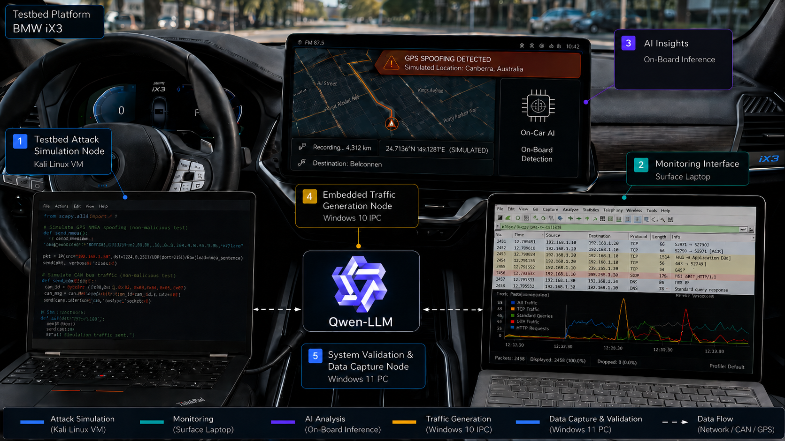

# EVTA



Electric Vehicles Threat Analysis LLM-based tool (EVTA-LLM) is a deployment-oriented Electric Vehicle (EV) traffic analysis and threat-detection feature extraction framework designed for both **offline dataset generation** and **real-time live monitoring**. The framework converts raw EV network traffic into enriched, analyst-friendly flow features suitable for cybersecurity research, operational monitoring, and machine learning pipelines.

Unlike traditional CSV-only flow extractors, EVTA acts as a complete **feature intelligence pipeline** capable of:

* Extracting enriched EV network flow features
* Monitoring live EV traffic in real time
* Generating partial-flow snapshots for early detection
* Producing deployment-readiness metrics
* Detecting behavioral heuristics automatically
* Generating local LLM-based analyst explanations
* Performing drift analysis and consistency validation
* Providing a desktop monitoring dashboard

The framework maintains a shared extraction pipeline between offline and live modes to preserve feature consistency across experiments and deployments.

---

# Key Features

| Capability                   | Description                                                           |
| ---------------------------- | --------------------------------------------------------------------- |
| **Offline extraction**       | Reads `.pcap` and `.pcapng` captures and exports enriched flow rows   |
| **Live monitoring**          | Captures live EV traffic directly from network interfaces             |
| **Partial-flow snapshots**   | Exports early-stage snapshots using packet or time milestones         |
| **Readiness scoring**        | Computes deployment-oriented confidence and stability scores          |
| **Host behavior enrichment** | Adds graph-style communication and host-window features               |
| **Built-in heuristics**      | Detects scans, beaconing, failed connections, and suspicious behavior |
| **Local LLM explanations**   | Generates analyst-readable summaries using local Qwen models          |
| **Desktop GUI dashboard**    | Provides real-time monitoring, alerts, visualizations, and controls   |
| **Drift analysis**           | Compares generated datasets against baseline feature distributions    |
| **Consistency validation**   | Verifies alignment between offline and live extraction paths          |

---

# Dashboard Overview

The EVTA desktop GUI provides a real-time operational monitoring interface.

### Dashboard Capabilities

* Live EV traffic monitoring
* Real-time metric cards
* Protocol distribution visualization
* Threat label summaries
* Alert-pressure monitoring
* Exported-flow visualization
* Heuristic activity stream
* Offline PCAP extraction
* Live capture controls
* Integrated CSV export
* Qwen LLM configuration support

The GUI uses the exact same extraction pipeline as the command-line interface to ensure feature consistency.

---

# Schema Overview

EVTA currently exports a rich **84-column schema** composed of:

| Schema Segment             | Columns | Examples                                             |
| -------------------------- | ------: | ---------------------------------------------------- |
| Identity columns           |       8 | `flow_id`, `src_ip`, `dst_ip`, timestamps            |
| Stable transport features  |      32 | packet counts, byte counts, TCP flags, timing        |
| Extended features          |      20 | retransmissions, TLS metadata, DNS statistics        |
| Advanced deployment fields |      22 | readiness scores, heuristic summaries, `llm_context` |
| Classification labels      |       2 | binary and multiclass labels                         |

The exported rows contain significantly more operational context than traditional flow extractors.

---

# Installation

Run all commands from the project root directory.

## Upgrade Packaging Tools

```bash
python3.11 -m pip install --upgrade pip setuptools wheel
```

## Editable Installation

```bash
python3.11 -m pip install -e .
```

## Standard Installation

```bash
python3.11 -m pip install .
```

---

# Dependencies

| Dependency     | Purpose                   |
| -------------- | ------------------------- |
| `dpkt`         | Offline PCAP decoding     |
| `scapy`        | Live packet capture       |
| `transformers` | Local LLM inference       |
| `torch`        | Transformer model backend |
| `PySide6`      | Desktop GUI framework     |

---

# Local Qwen Integration

EVTA supports local LLM-generated analyst explanations through Hugging Face Transformers.

Default model:

```text
Qwen/Qwen2.5-0.5B-Instruct
```

Generated explanations are written into the:

```text
llm_context
```

column.

## Example

```python
from transformers import AutoModelForCausalLM, AutoTokenizer

model_name = "Qwen/Qwen2.5-0.5B-Instruct"

tokenizer = AutoTokenizer.from_pretrained(model_name)
model = AutoModelForCausalLM.from_pretrained(model_name)

prompt = "Explain black holes simply"
inputs = tokenizer(prompt, return_tensors="pt")

outputs = model.generate(**inputs, max_new_tokens=96)
print(tokenizer.decode(outputs[0]))
```

Inside EVTA, the prompt contains the full extracted feature row instead of a simple text prompt.

---

# Running EVTA

The framework can be executed in multiple ways depending on the workflow.

---

# Run Without Installation

You can execute EVTA directly from the project root.

## Offline Extraction

```bash
python -m EVTA \
  --mode offline \
  --input sample.pcap \
  --output EVTA_features.csv
```

## Offline Extraction with Qwen

```bash
python -m EVTA \
  --mode offline \
  --input sample.pcap \
  --output EVTA_features_llm.csv \
  --enable-llm-context
```

## Live Monitoring

```bash
python -m EVTA \
  --mode live \
  --interface eth0 \
  --output EVTA_live.csv
```

## Launch GUI

```bash
python -m EVTA.gui
```

---

# Run After Installation

After installing with:

```bash
pip install -e .
```

You can launch EVTA directly from the terminal.

## Offline Extraction

```bash
EVTA \
  --mode offline \
  --input sample.pcap \
  --output EVTA_features.csv
```

## Offline Extraction with Labels

```bash
EVTA \
  --mode offline \
  --input sample.pcap \
  --output EVTA_attack.csv \
  --binary-label attack \
  --multiclass-label port_scan
```

## Offline Extraction with Partial Snapshots

```bash
EVTA \
  --mode offline \
  --input sample.pcap \
  --output EVTA_partial.csv \
  --enable-partial \
  --partial-packet-steps 1,3,5,10 \
  --partial-time-steps 1,5,10
```

## Offline Extraction with Local Qwen Context

```bash
EVTA \
  --mode offline \
  --input sample.pcap \
  --output EVTA_llm.csv \
  --enable-llm-context \
  --llm-model-name Qwen/Qwen2.5-0.5B-Instruct \
  --llm-max-new-tokens 96
```

## Offline Extraction with Drift Reports

```bash
EVTA \
  --mode offline \
  --input current_capture.pcap \
  --output EVTA_current.csv \
  --baseline-csv baseline.csv \
  --report-prefix reports/current_run
```

## Live Monitoring

```bash
EVTA \
  --mode live \
  --interface eth0 \
  --output EVTA_live.csv
```

## Live Monitoring with Safe Profile

```bash
EVTA \
  --mode live \
  --interface eth0 \
  --output EVTA_live_safe.csv \
  --profile live-safe
```

## Live Monitoring with Qwen Context

```bash
EVTA \
  --mode live \
  --interface eth0 \
  --output EVTA_live_llm.csv \
  --enable-llm-context
```

## Launch GUI

```bash
EVTA-gui
```

---

# Running the Benchmark

The benchmarking pipeline evaluates EVTA features using both classical machine learning and deep learning models.

## Run Level 3 Benchmark

```bash
python Benchmarking/Benchmarking.py
```

or:

```bash
python benchmark_level3.py
```

depending on the file name.

---

# Benchmark Workflow

The benchmark automatically:

1. Loads the EV dataset
2. Cleans invalid rows
3. Splits train/test data
4. Removes Level 3 restricted features
5. Applies preprocessing
6. Trains classical models
7. Trains deep learning models
8. Computes evaluation metrics
9. Saves benchmark reports

---

# Generated Benchmark Files

```text
train_split_level3.csv
```

```text
test_split_level3.csv
```

```text
binary_level3_benchmark_results.csv
```

```text
multiclass_level3_benchmark_results.csv
```

```text
all_level3_benchmark_results.csv
```

---

# Usage

EVTA supports both:

* Command-line workflows
* Desktop GUI workflows

---

# Launch GUI

```bash
python -m EVTA.gui
```

or after installation:

```bash
EVTA-gui
```

---

# Offline Extraction

```bash
EVTA \
  --mode offline \
  --input sample.pcap \
  --output EVTA_features.csv
```

---

# Offline Extraction with Local Qwen Context

```bash
EVTA \
  --mode offline \
  --input sample.pcap \
  --output EVTA_features_with_llm.csv \
  --enable-llm-context \
  --llm-model-name Qwen/Qwen2.5-0.5B-Instruct \
  --llm-max-new-tokens 96
```

---

# Partial Snapshot Extraction

```bash
EVTA \
  --mode offline \
  --input sample.pcap \
  --output EVTA_v7_llm.csv \
  --enable-partial \
  --binary-label attack \
  --multiclass-label port_scan \
  --enable-llm-context \
  --partial-packet-steps 1,3,5,10 \
  --partial-time-steps 1,5,10
```

---

# Live Monitoring

```bash
EVTA \
  --mode live \
  --interface eth0 \
  --output EVTA_live.csv
```

---

# Live Monitoring with Qwen

```bash
EVTA \
  --mode live \
  --interface eth0 \
  --output EVTA_live_safe_llm.csv \
  --profile live-safe \
  --enable-partial \
  --enable-llm-context \
  --llm-model-name Qwen/Qwen2.5-0.5B-Instruct \
  --llm-max-new-tokens 96
```

---

# Important Arguments

| Argument                 | Description                           |
| ------------------------ | ------------------------------------- |
| `--mode`                 | Selects offline or live extraction    |
| `--input`                | Input PCAP or PCAPNG file             |
| `--interface`            | Live capture interface                |
| `--output`               | Output CSV path                       |
| `--enable-llm-context`   | Enables local Qwen generation         |
| `--llm-model-name`       | Hugging Face model name or local path |
| `--llm-max-new-tokens`   | Maximum generated tokens              |
| `--enable-partial`       | Enables partial-flow export           |
| `--partial-packet-steps` | Packet milestones                     |
| `--partial-time-steps`   | Time milestones                       |
| `--baseline-csv`         | Baseline CSV for drift analysis       |
| `--report-prefix`        | Prefix for generated reports          |
| `--bpf-filter`           | Optional live-capture filter          |
| `--duration`             | Maximum capture duration              |
| `--max-packets`          | Maximum captured packets              |
| `--poll-interval`        | Flow flush interval                   |
| `--no-promisc`           | Disable promiscuous mode              |

---

# Output Profiles

| Profile       | Purpose                               |
| ------------- | ------------------------------------- |
| `full`        | Complete 84-column export             |
| `research`    | Research-oriented reproducible export |
| `stable-core` | Robust deployment-oriented features   |
| `live-safe`   | Streaming-safe operational profile    |

---

# Generated Reports

| Artifact           | Purpose                            |
| ------------------ | ---------------------------------- |
| `.consistency.csv` | Offline/live mismatch report       |
| `.consistency.md`  | Human-readable consistency summary |
| `.drift.csv`       | Feature drift statistics           |
| `.drift.md`        | Human-readable drift report        |

---

# Project Structure

| File                   | Responsibility                  |
| ---------------------- | ------------------------------- |
| `EVTA/cli.py`          | CLI parsing and orchestration   |
| `EVTA/pipeline.py`     | Shared execution pipeline       |
| `EVTA/live_capture.py` | Live capture logic              |
| `EVTA/flows.py`        | Flow aggregation and enrichment |
| `EVTA/heuristics.py`   | Threat heuristics               |
| `EVTA/llm_context.py`  | Local Qwen integration          |
| `EVTA/readiness.py`    | Readiness scoring               |
| `EVTA/drift.py`        | Drift analysis                  |
| `EVTA/consistency.py`  | Offline/live validation         |
| `EVTA/exporter.py`     | CSV export logic                |
| `EVTA/gui.py`          | Desktop GUI dashboard           |

---

# Feature Extraction Levels

EVTA supports multiple feature-extraction difficulty levels designed for realistic IDS benchmarking and fair evaluation.

The goal of the levels is to progressively remove shortcut, leakage, and deployment-unrealistic features so that models are evaluated under increasingly realistic operational conditions.

| Level       | Description                   | Characteristics                                                                                  |
| ----------- | ----------------------------- | ------------------------------------------------------------------------------------------------ |
| **Level 1** | Full feature benchmark        | Uses nearly all extracted features including highly predictive operational metadata              |
| **Level 2** | Reduced shortcut benchmark    | Removes obvious leakage and strongly attack-specific indicators                                  |
| **Level 3** | Deployment-oriented benchmark | Removes direct leakage, heuristics, strong shortcut features, and environment-sensitive metadata |

---

# Level 3 Benchmarking Philosophy

The included Level 3 benchmark is intentionally designed to be significantly harder and more deployment realistic than standard IDS evaluations.

Instead of allowing models to rely on direct attack shortcuts, heuristic outputs, or environment-dependent metadata, the benchmark removes:

* Heuristic-generated labels
* LLM-generated summaries
* Readiness scoring outputs
* Direct traffic shortcuts
* Strong scan indicators
* Highly predictive timing shortcuts
* Direct protocol and port leakage
* Host-window shortcut statistics
* Export metadata

This forces models to learn more generalized behavioral patterns rather than memorizing highly correlated indicators.

The benchmark therefore evaluates whether a model can still detect malicious EV traffic under realistic deployment constraints.

---

# Benchmark Tasks

The benchmarking pipeline supports two primary tasks.

| Task                          | Target Column               | Purpose                                |
| ----------------------------- | --------------------------- | -------------------------------------- |
| **Binary classification**     | `binary_classification`     | Distinguishes benign vs attack traffic |
| **Multiclass classification** | `multiclass_classification` | Identifies specific attack categories  |

The dataset is automatically split into training and testing partitions using stratified sampling.

---

# Benchmark Model Families

The framework evaluates both classical machine learning models and deep learning architectures.

## Classical Models

| Model         | Purpose                            |
| ------------- | ---------------------------------- |
| Random Forest | Ensemble tree-based classifier     |
| Extra Trees   | Randomized ensemble classifier     |
| Linear SVM    | High-dimensional linear classifier |

## Deep Learning Models

| Model       | Purpose                                           |
| ----------- | ------------------------------------------------- |
| CNN         | Learns local feature interactions                 |
| RNN         | Sequential feature modeling                       |
| LSTM        | Long-term sequential dependency learning          |
| KAN-style   | Lightweight kernel-inspired approximation network |
| Transformer | Attention-based feature interaction modeling      |

---

# Benchmark Pipeline

The Level 3 benchmark pipeline performs the following stages.

1. Load the full EVTA dataset
2. Clean invalid and duplicated rows
3. Split the dataset into train/test partitions
4. Remove Level 3 restricted features
5. Remove constant-value columns
6. Apply preprocessing:

   * Median imputation for numeric fields
   * Most-frequent imputation for categorical fields
   * Standard scaling
   * One-hot encoding
7. Train classical models
8. Train deep learning models
9. Evaluate using multiple metrics
10. Export benchmark reports

---

# Evaluation Metrics

The benchmark computes multiple metrics to provide balanced evaluation across imbalanced datasets.

| Metric           | Meaning                             |
| ---------------- | ----------------------------------- |
| Accuracy         | Overall prediction correctness      |
| Precision Macro  | Average precision across classes    |
| Recall Macro     | Average recall across classes       |
| F1 Macro         | Balanced class-wise performance     |
| F1 Weighted      | Weighted performance across classes |
| MCC              | Matthews correlation coefficient    |
| Confusion Matrix | Class-level prediction breakdown    |

---

# Benchmark Outputs

The benchmark automatically generates:

| Output File                               | Purpose                                 |
| ----------------------------------------- | --------------------------------------- |
| `train_split_level3.csv`                  | Training split                          |
| `test_split_level3.csv`                   | Testing split                           |
| `binary_level3_benchmark_results.csv`     | Binary classification benchmark results |
| `multiclass_level3_benchmark_results.csv` | Multiclass benchmark results            |
| `all_level3_benchmark_results.csv`        | Combined benchmark summary              |

---

# Interpretation Guidance

| Column                      | Meaning                                  |
| --------------------------- | ---------------------------------------- |
| `live_readiness_score`      | Operational deployment suitability       |
| `heuristic_label`           | Human-readable behavior category         |
| `heuristic_score`           | Relative heuristic confidence            |
| `llm_context`               | Local Qwen-generated analyst explanation |
| `binary_classification`     | User-supplied binary label               |
| `multiclass_classification` | User-supplied multiclass label           |
| `snapshot_kind`             | Final flow or partial snapshot           |
| `export_reason`             | Reason the row was exported              |

---

# Notes

* Enabling `--enable-llm-context` increases runtime and memory usage.
* CPU-only systems should start with:

```text
Qwen/Qwen2.5-0.5B-Instruct
```

* Lower `--llm-max-new-tokens` values improve performance.
* The framework is designed to preserve feature consistency between offline and live modes.
* Heuristic labels are analyst aids and should not be treated as absolute ground truth.
* The `llm_context` field contains model-generated summaries, not verified facts.

---

# License

Add your preferred license here.
